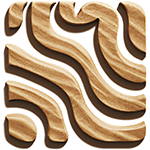

# GCode Woodener



A standalone tool for adding temperature changes throughout a gcode file.

Comes with a GUI or can also be used from the command line / terminal


## Features

 * Maximum and Minimum temperature setting
 * Non-continuous temperature steps, to improve contrast
 * Configurable number of layers per temperature change
 * Shows thumbnail embedded in gcode (GUI only)

## Installation

[Download the latest release .exe file here.](https://github.com/manticorp/GcodeWoodener/releases)

Or download the source code and run using python.

## Example Output


Model from [McRats on Thingiverse](https://www.thingiverse.com/thing:2637495)

## Usage

### GUI

1. Double click GcodeWoodgrainer.exe
2. Open your file using the open button
3. You will be shown the thumbnail and a summary of file info (layers, lines, etc)
4. Set the parameters which you wish to use for the min/max temp, step and number of layers per temperature change
5. Hit Save to process the file and save the output


### Terminal

To use you will need PIL installed

```python3 -m pip install --upgrade Pillow```

```
PS C:\GcodeWoodener> python3 GcodeWoodgrainer.py --help

usage: Gcode Woodgrainer [-h] [-o OUTNAME] [-t MAXTEMP] [-b MINTEMP] [-s STEP] [-n NUMLAYERS] [-c] [-x] [-v]
                         [filename]

Adds woodgrain to a gcode file using woodfill filament by varying the temperature randomly over layers

positional arguments:
  filename

options:
  -h, --help            show this help message and exit
  -o OUTNAME, --outname OUTNAME
                        Output filename - defaults to input filename
  -t MAXTEMP, --maxtemp MAXTEMP
                        Maximum temperature
  -b MINTEMP, --mintemp MINTEMP
                        Minimum temperature
  -s STEP, --step STEP  Temperature step size, e.g if 5, possible temps are 200, 205, 210, 215 etc
  -n NUMLAYERS, --numlayers NUMLAYERS
                        How many layers per temp change
  -c, --commandline     Command line only version (headless, no gui)
  -x, --verbose         Verbose output
  -v, --version         show program's version number and exit

```

#### Examples

Modifies file ```input.gcode``` in place, from 200&deg;C to 250&deg;C in 5&deg;C gradations for 2 layers per temperature change

```python3 GCodeWoodgrainer.py -b 200 -t 250 -s 5 -n 2 input.gcode```

Modifies the file ```input.gcode``` using standard parameters and saves it to ```output.gcode```

```python3 GCodeWoodgrainer.py -o output.gcode input.gcode```

## How it works

Filament that contains a certain percentage of wood fibres will appear darker when extruded at higher temperatures.

This fact can be exploted to create a wood grain effect on a print.

By scanning a gcode file and looking for layer changes, we insert an ```M104``` gcode command to vary the temperature as time goes on.

Here is an [example file](example_output.gcode) showing the temperature changes generated using this application, with the following settings:

 * min 200&deg;C
 * max 240&deg;C
 * step 5&deg;C
 * layers 2


Here is an [example file](example_output.gcode) showing the temperature changes generated using this application, with the following settings:

 * min 200&deg;C
 * max 240&deg;C
 * step 40&deg;C
 * layers 2


### Tips

#### Layer Change Detection

It is actually quite difficult to reliably detect layer changes in a gcode file.

The software looks for files that contain one of the following strings:

 * ```;BEFORE_LAYER_CHANGE```
 * ```;LAYER```
 * ```;WOODGRAIN_INSERT_LAYER```
 
i.e. your slicer should insert one of those strings at a layer change.

#### Recommended print settings

Print infill first - this gives the printer a bit of time to get up to temperature before printing the perimeters.


Print slowly - this will help to pronounce the effect.

## Building

Can be built with pyinstaller. See [build.bat](build.bat) for example Windows build.

## Improvements / To Do

- [x] Automate testing
- [x] Show progress
- [x] Include some example printed images
- [ ] Make layer change search string configurable
- [ ] Smooth changes, instead of stepped changes?
- [ ] Changes within layers for more variation on larger objects
- [ ] Build for Linux
- [ ] Build for Mac OS